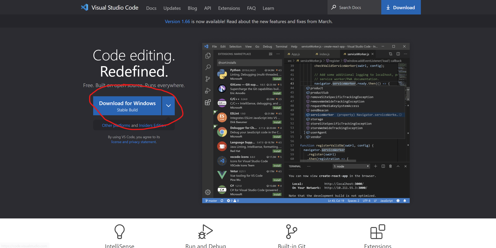
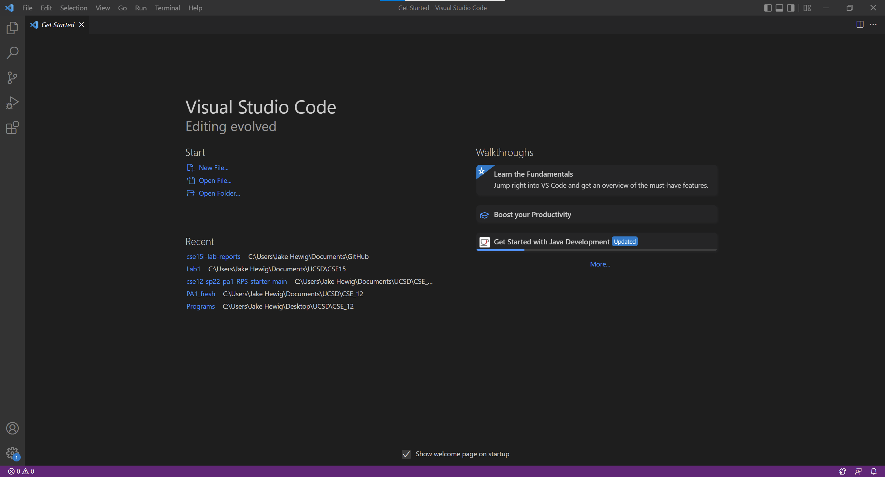
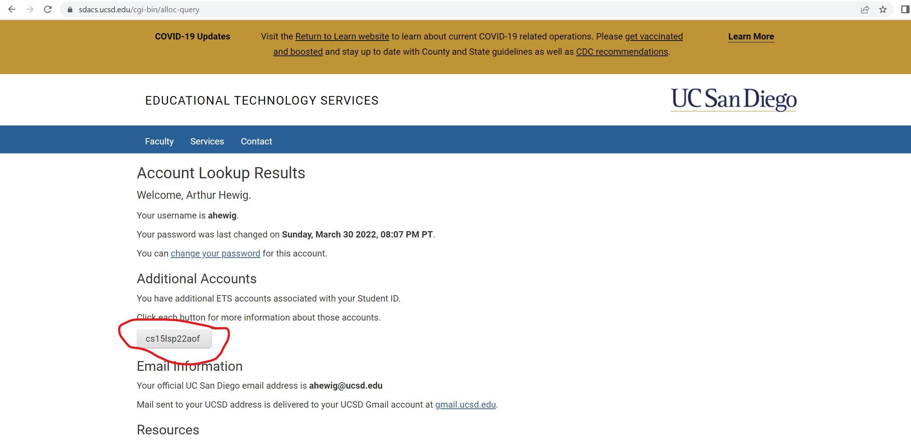
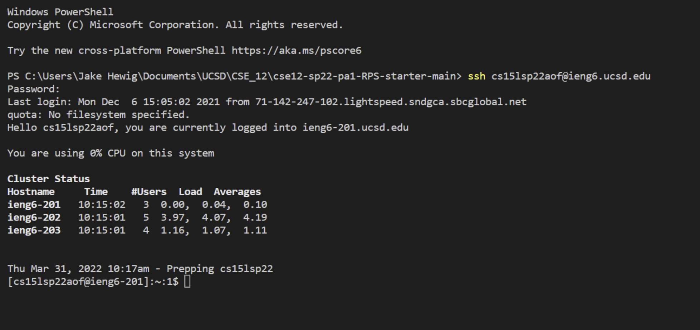
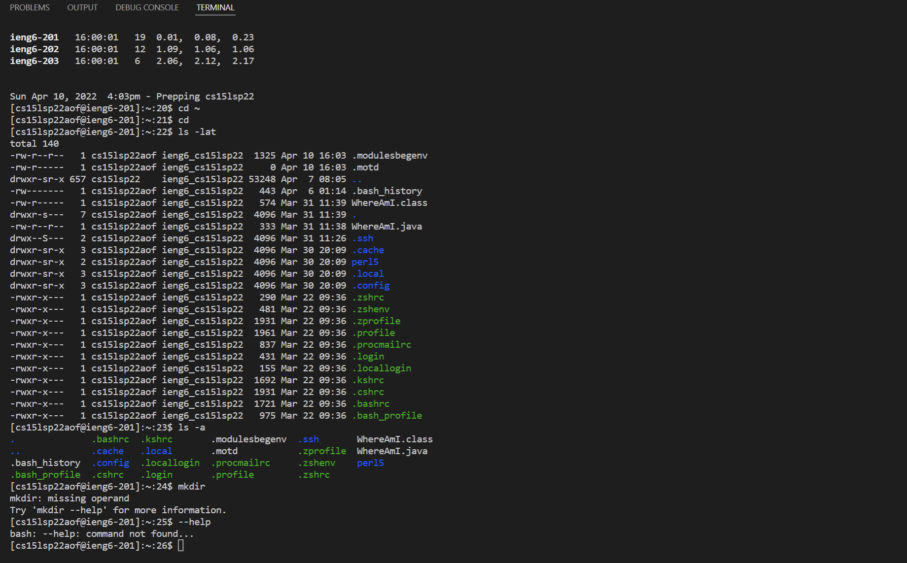
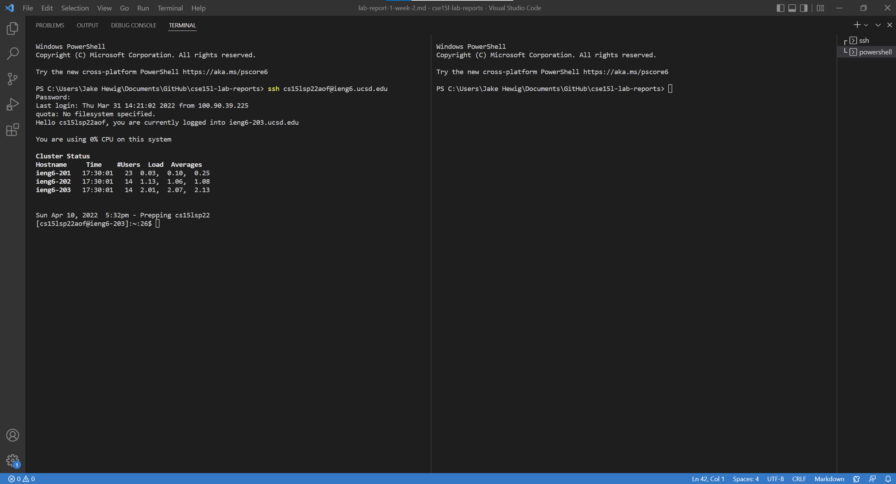

# Week 1 and 2 Lab Report

## **1. Installing VScode**

- Begin by going to [https://code.visualstudio.com/](https://code.visualstudio.com/) to download Visual Studio Code by clicking on the button in the red circle in the image above and following the directions for your specific operating system on the website.

- After downloading and installing VScode, you should reach a home screen that looks like the one in the image above.

---
## **2. Remotely Connecting**
- The first step to Remotely Connect is to follow the directions at [this](https://docs.microsoft.com/en-us/windows-server/administration/openssh/openssh_install_firstuse) website to download and install a program called OpenSSH.
- After installing OpenSSH, you will need to retrieve your cse15L Account name which can be found at [this](https://sdacs.ucsd.edu/~icc/index.php) website. Enter your UCSD username and account name to retrieve your cse15L account name.
- Your account name will be located on the website circled in red in the image below, your account will have the 'aof' replaced with a different set of characters

- If you haven't already, reset your global password for your cse15L account. You may need to wait 5-15 minutes to allow the password to be reset. Keep it stored to log onto the server when necessary.
- Remotely Connecting to the server requires you to open up Visual Studio Code, or another way to access your command terminal and entering the command:

`$ ssh <your cse15l account name>@ieng6.ucsd.edu`
- On the first time connecting, you will be asked the question:

`$ Are you sure you want to continue connecting (yes/no/[fingerprint])?`
- enter yes into the command terminal, and enter your global cse15l password when prompted for it, it should be what you reset it as earlier.

- After connecting and entering your password, your command terminal should look like this:

---
## **3. Trying Some Commands**
- Now it's time to try running some commands in the command line while connected to the server.
- You can start by trying commands in the terminal such as cd, ls, pwd, mkdir, cp both on the server, and on your own client after signing out of the server, which can be done by splitting the terminal in vscode or exiting the server with the `exit` command.
- Running commands should produce results such as this image below:

- Some of the commands may produce errors either on the server or your own client, this is to be expected, but it's important to note the differences between the viability of the commands both on the server and on the client.

---
## **4. Moving Files With SCP**
- If you're using VS Code, for this step I would reccomend splitting the terminal using the split terminal command, which should produce a terminal that looks like this:

- From there, you can use the SCP command to  move files to and from your client and the server. 
- Once you have a file you want to transfer to the server, and your are in the directory of that file on your client's command terminal, write the command:
`$ scp <your file name>.java <your username>@ieng6.ucsd.edu:~/`
- Enter your password when prompted, and then if all has gone correctly, your file will be transferred over to the server into the home directory
- You can now compile and run that program on the server using javac and java

---
## **5. Setting an SSH Key**

---
## **6. Optimizing Remote Running**

---
I wasn't able to get parts five and six finished yet, but I plan to have them finished by tomorrow 