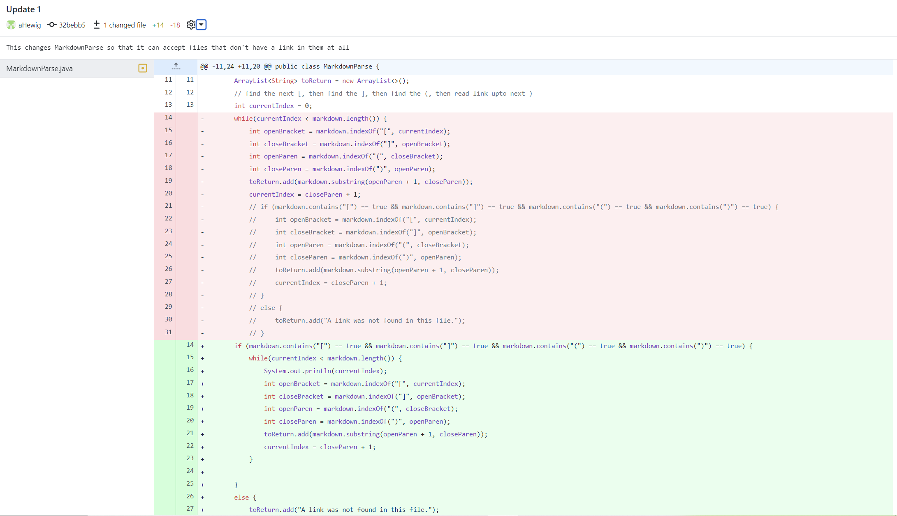
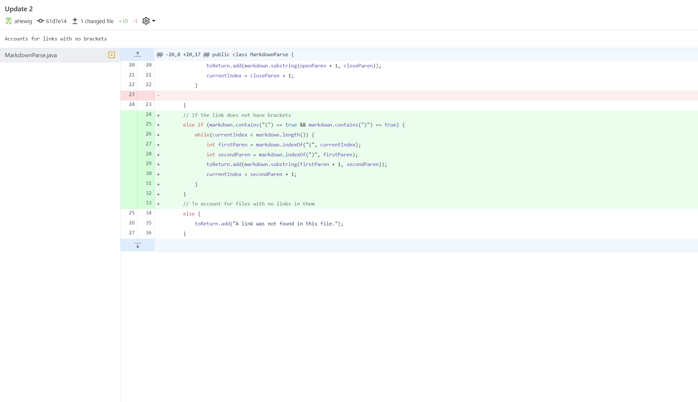
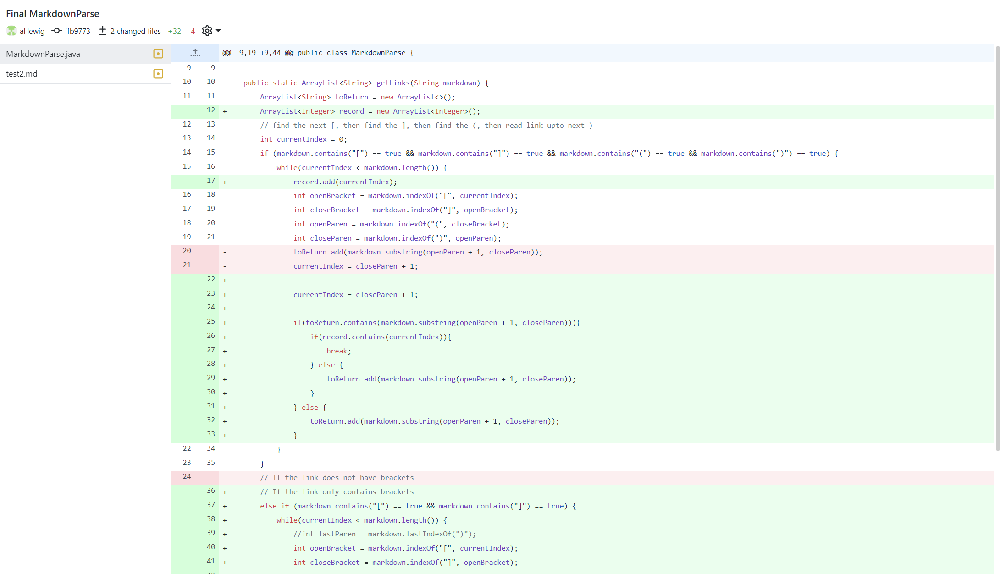
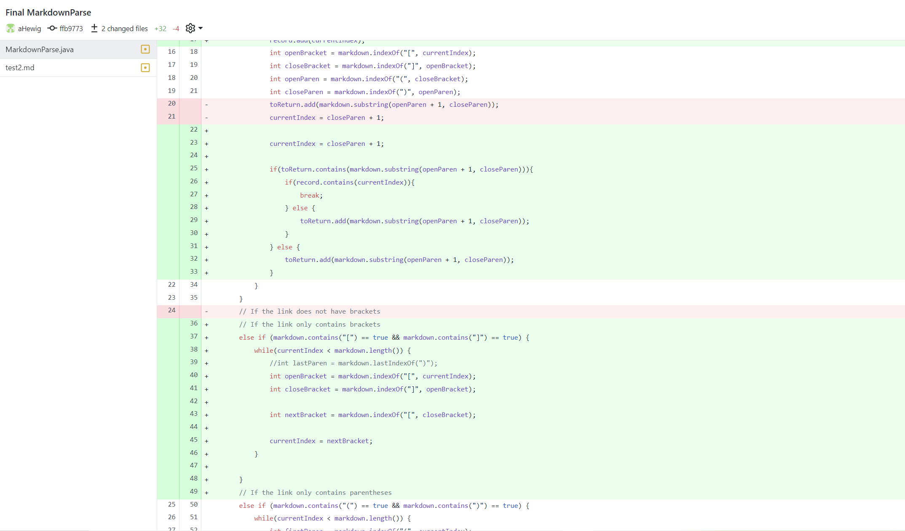

# Lab Report 2
---
## Code Change 1

The test file that caused this change to be necessary was [Test 4](https://github.com/aHewig/markdown-parser/blob/main/test4.md)

- Before making this change, the output was: 

`Exception in thread "main" java.lang.StringIndexOutOfBoundsException: Range [0, -1) out of bounds for length 35
        at java.base/jdk.internal.util.Preconditions$1.apply(Preconditions.java:55)
        at java.base/jdk.internal.util.Preconditions$1.apply(Preconditions.java:52)
        at java.base/jdk.internal.util.Preconditions$4.apply(Preconditions.java:213)
        at java.base/jdk.internal.util.Preconditions$4.apply(Preconditions.java:210)
        at java.base/jdk.internal.util.Preconditions.outOfBounds(Preconditions.java:98)
        at java.base/jdk.internal.util.Preconditions.outOfBoundsCheckFromToIndex(Preconditions.java:112)       
        at java.base/jdk.internal.util.Preconditions.checkFromToIndex(Preconditions.java:349)
        at java.base/java.lang.String.checkBoundsBeginEnd(String.java:4589)
        at java.base/java.lang.String.substring(String.java:2703)
        at MarkdownParse.getLinks(MarkdownParse.java:19)
        at MarkdownParse.main(MarkdownParse.java:44)`

- This change was made in order to adjust for files that have no links, which I defined as files that have no brackets or parentheses. Before, if there was a file with no brackets or parentheses, the program would produce an IndexOutOfBoundsException because the success of the program was predicated on being able to find the parentheses to find a string, with no option for that not to be the case, so when the indexOf methods returned -1, those indices were of the bounds of the array. This change is very simple in that it's just an if statement, and if both open and closed parentheses and brackets are found, the program continues as before, but if they are not all found, then it will go to the else statement and add the string `"A link was not found in this file."` to the toReturn ArrayList, which will then be printed in the main method.
---

## Code Change 2

The test file that caused this change to be necessary was [Test 3](https://github.com/aHewig/markdown-parser/blob/main/test3.md)

- Before making this change, the output was: 

`PS C:\Users\Jake Hewig\Documents\GitHub\markdown-parser> java MarkdownParse test3.md
[A link was not found in this file.]`

- While not producing an error, this output is a product of the previous change I made to the program in Change 1, specifically the else statement. The earlier program defined any file that didn't contain open and closed parentheses and brackets as not containing any links, but I wanted to change the program to allow for links without brackets. In markdown the link in File 3 would not be a valid link, however links with no brackets was written as one option to try in the lab writeup. This change again just adds an if statement to the program making it so that if open and close parentheses are contained in the file, and by exclusion no brackets, the program can still find the link by returning the substring between two parentheses within the file.

---
## Code Change 3

The test file that caused this change to be made was [Test 2](https://github.com/aHewig/markdown-parser/blob/main/test2.md)

- Before making this change, the output was: 

`PS C:\Users\Jake Hewig\Documents\GitHub\markdown-parser> java MarkdownParse test2.md
Exception in thread "main" java.lang.OutOfMemoryError: Java heap space
        at java.base/java.util.Arrays.copyOf(Arrays.java:3512)        
        at java.base/java.util.Arrays.copyOf(Arrays.java:3481)        
        at java.base/java.util.ArrayList.grow(ArrayList.java:237)     
        at java.base/java.util.ArrayList.grow(ArrayList.java:244)     
        at java.base/java.util.ArrayList.add(ArrayList.java:454)      
        at java.base/java.util.ArrayList.add(ArrayList.java:467)      
        at MarkdownParse.getLinks(MarkdownParse.java:18)
        at MarkdownParse.main(MarkdownParse.java:72)`

- The previous version of markdownparser would run into an infinite loop if there were extra closing parentheses or characters after the closing parentheses in the names of the links. This was because the program would never move on to the next line if there were extra closing parentheses or characters after the closing parentheses. In test2.md, link 3 and 4 would produce these infinite loops. The use of another arraylist to keep track of which current indexes had already been looked at by the program solves this problem.