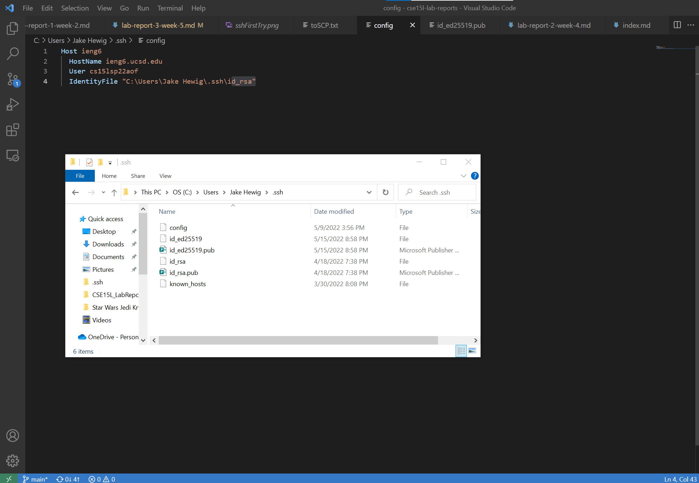

# Lab Report 3
---

## Part 1: Streamlining ssh Configuration
I edited my config file using VSCode, it was located in the .ssh directory of my personal User directory.

**The location of my file:**

---

**Logging in using my alias:**

---

**Using scp to copy over a file I made called toSCP to the server, using just my alias:**

---

## Part 2: Setup Github Access from ieng6

**Location of my public key:**

---

## Part 3: Copy whole directories with scp -r

**Copying my entire directory including the .git files:**

---

**Compiling and running my tester on the ssh server:**

---

**Copying my entire directory and running the tests on one line:**

