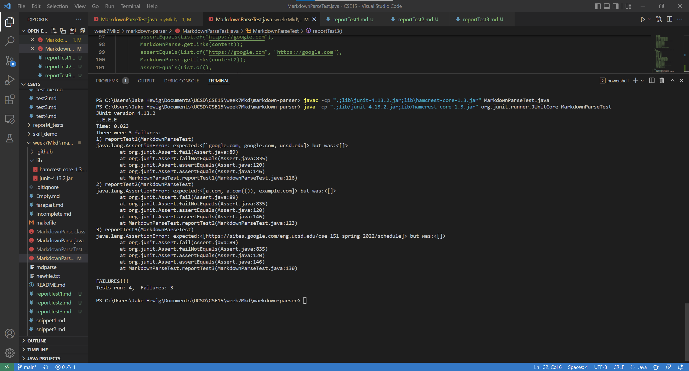

# Lab Report 4
---

## Tests for Our Implementation:

## Tests for The Week 7 Implementation:

## Test Results for Our Implementation:

- Each of the three tests failed

## Test Results for The Week 7 Implementation:

- Each of the three tests failed

## Discussion 

### Snippet 1:
- Since our implementation does not recognize 
backticks in a markdown file as a block of code, 
it still recognized url.com as a link, when it 
wasn't a valid link because the first bracket was 
betwen two backticks. Using an if statement to recognize backticks, you could move current index
to the index of the next backtick + 1, and then check if their was an open parentheses or bracket
in between those two backticks, and if so moving current index to the next open bracket. 

### Snippet 2:
- Our implementation failed the second test because of the way it made closeParen the index of ")" in the while loop. 
To fix this, we could make it so closeParen is the lastIndexOf(")", openParen) before the next index of ("[").

### Snippet 3:
- 
