# Lab Report 5

---

## Explanation:
- I used vimdiff to compare the results.txt of each implementation
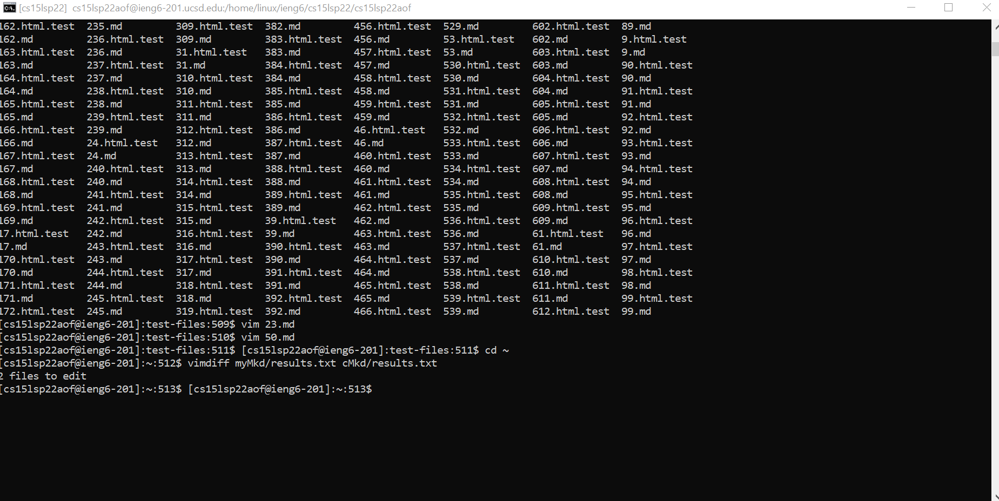
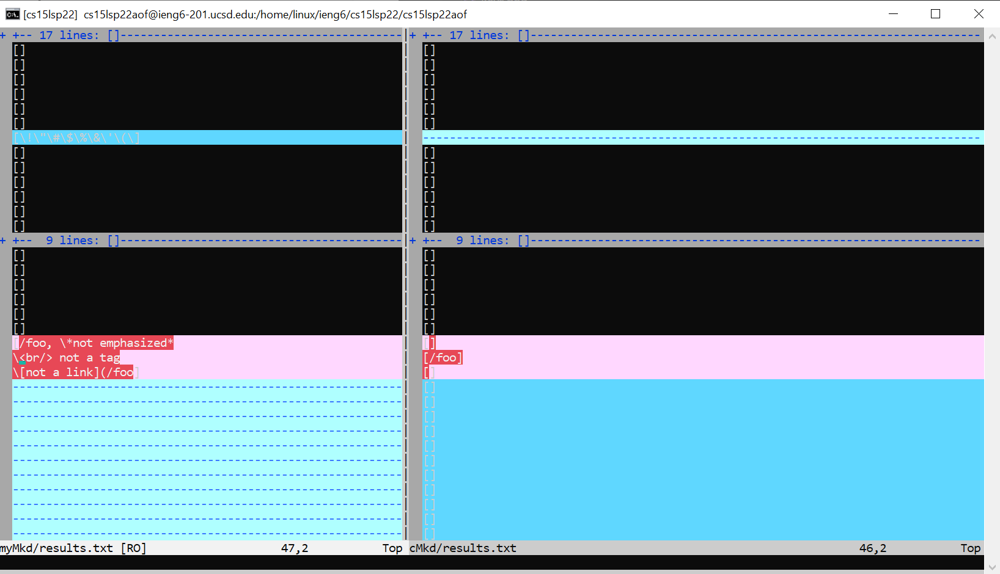

- I also used some manual searching after adding an echo print statement to script.sh to find the correct files 
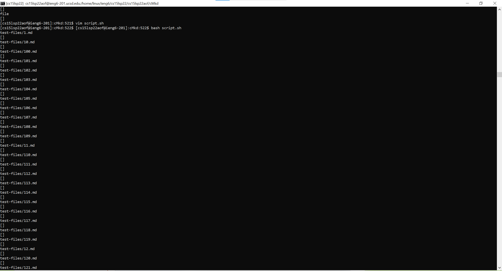
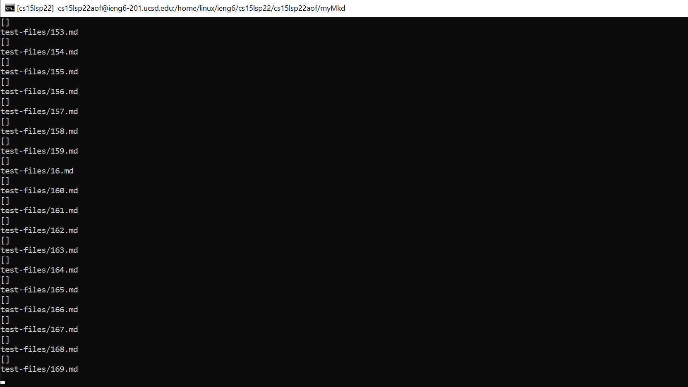

## Failing Tests:

---

### Failed Test 1
- 14.md
- A link to [14.md](https://github.com/nidhidhamnani/markdown-parser/blob/main/test-files/14.md)

- This was the output for the file using the class implementation:
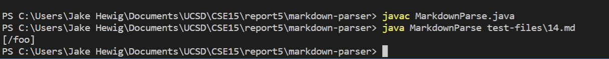
- The output for my implementation:
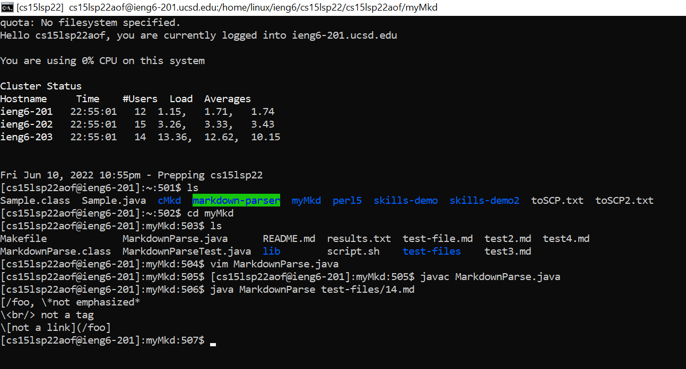
- Both my implementation and the class implementation had the incorrect output

- This was the correct output for the file:
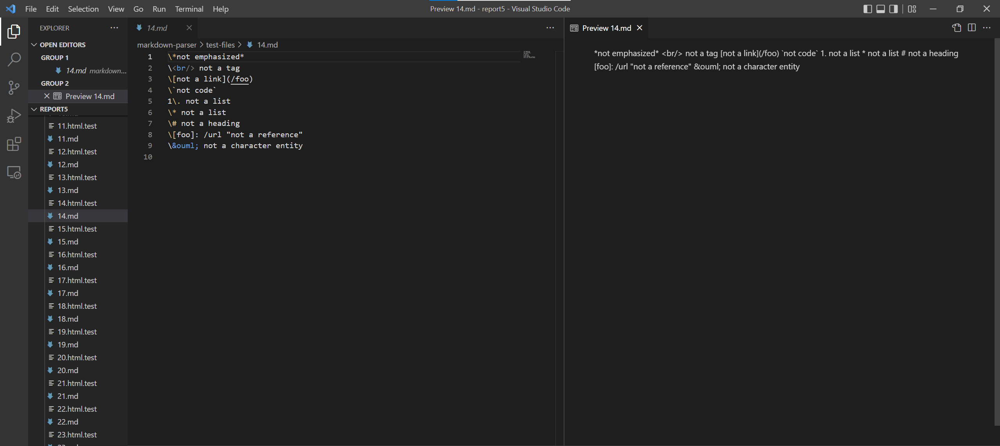
- I chose to focus on the class implementation for this test file output
- It's supposed to have no links, but the implementation from the class included /foo as an output because it does not recognize other parts of 
markdown that would invalidate links like having a `\` in front of the link.
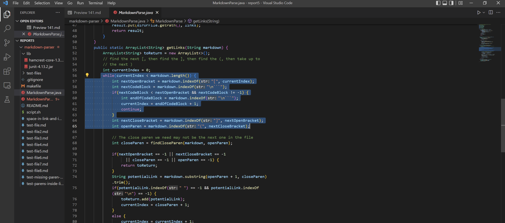
- This block of code (and really the whole method) would need to be changed to include searching for things that break links like  `\`

---

### Failed Test 2
- 142.md
- A link to [142.md](https://github.com/nidhidhamnani/markdown-parser/blob/main/test-files/142.md)

- This was the output for the file using my implementation, an infinite loop:
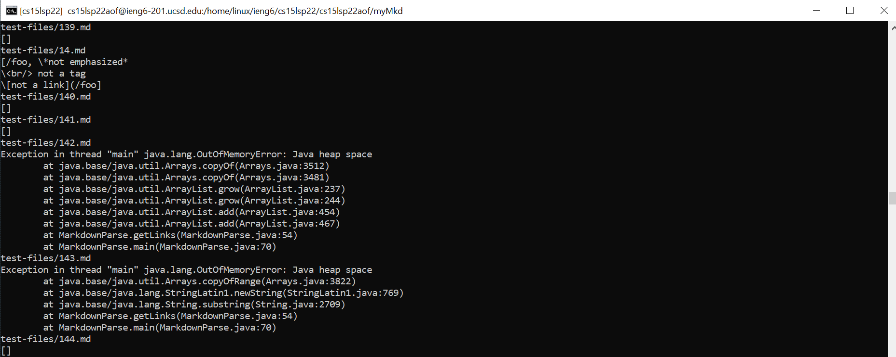

- This was the output with the class implementation:
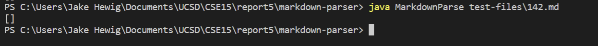

- This is what the output was supposed to look like:
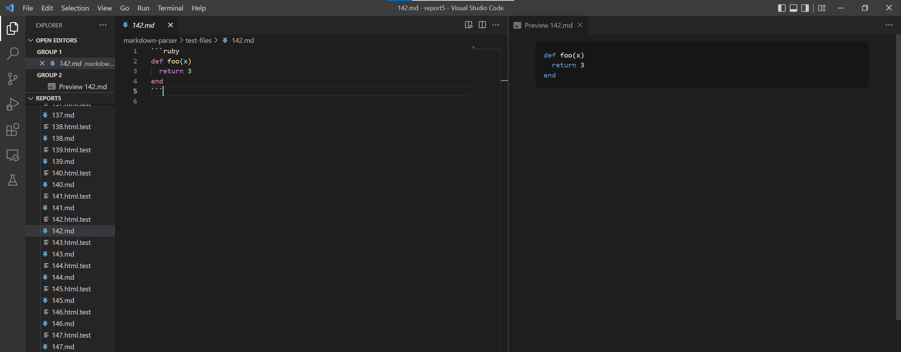
- it had no valid links

- My implementation had the incorrect output and the class implementation had the correct output

- My implementation:
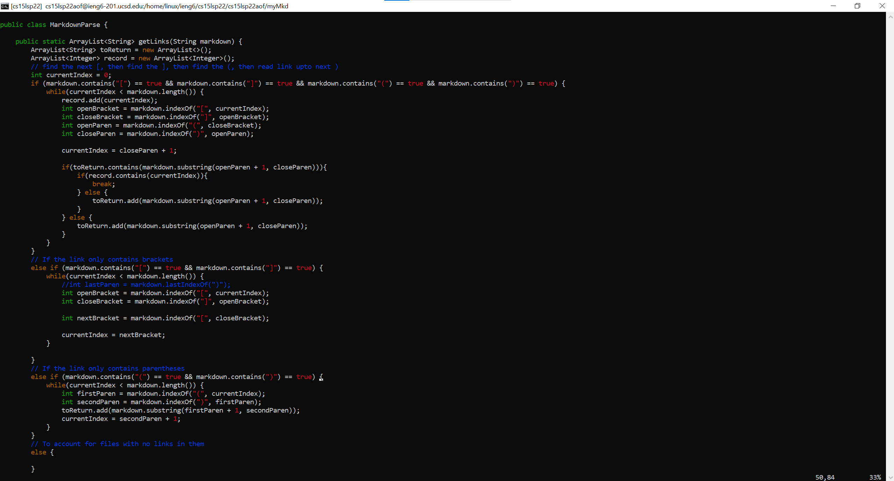
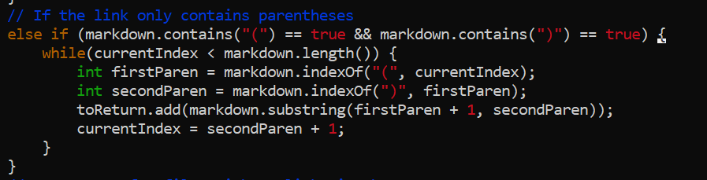
- Since 142.md has two parentheses, but no brackets, this while loop must be running infinitely. I believe it's because there is more text after the while loop has run one time, and then indexOf("(", currentIndex) returns negative one every time, causing current index to never greater than or equal to the length of the file. I should just delete these if statements, when I wrote them I didn't understand exactly what a valid link was anyway.

